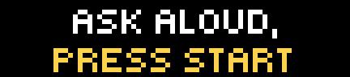
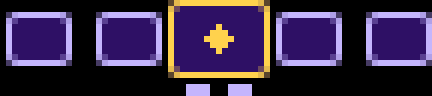
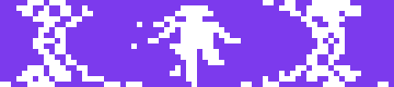
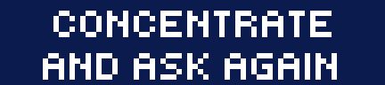
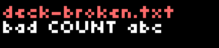

# Knock Roll Die

Tarot, a magic 8 ball and dice for the [BUSY Bar](https://busy.bar), on its 72×16 pixel display.
Ask a question out loud, spin the wheel, press Start.

| | | |
| --- | --- | --- |
|  |  |  |
|  |  |  |

## How it plays

1. **Start screen** – the deck's own phrase ("Ask aloud, press Start"). Start continues.
2. **The wheel** – face-down cards sliding past a framed one in the middle. Turn the dial to launch the wheel, or press Start for a
   launch of random strength; more turns of the dial while it spins send it faster still. One spin lasts at least 12 seconds and shows every card of the deck
   at least once (tarot: about 15 seconds): it slows down step by step and settles on a card. Press Start while it spins to brake sooner. The cards move at 60 frames a second, played by the bar itself.
3. **The result** – the card grows to fill the screen and shows what the deck says: art, text, a die face or a number. A result can
   have several steps (a tarot card, then its prediction); Start moves through them.
4. After the last result of a reading the app returns to the start screen.

**Auto play** (**Settings → Auto play**) is *Off*, *One game* or *Random game*. Both have no start screen: the app spins the wheel by
itself, shows each screen of a result for three seconds, and after the last result of a game shows "next game in 5" and starts over -
for ever. *One game* plays the chosen deck again and again; *Random game* takes another deck for every game (the countdown names it;
the lotto and bingo, which are a whole game by themselves, are left out). Start skips a wait or brakes the wheel; Back quits.
**Settings → Sound** turns every sound off, the wheel's clicks included.

The wheel clicks for every card that passes the frame, so you hear its speed: dense clicks while it flies, ever further apart as it
slows, and quickening again when you give it another turn of the dial. The wheel starting, settling, the result opening and moving
to its next step have sounds too. **Settings → Sound** turns them
off; the bar's own volume setting still applies.

### Your own sounds

The sounds are five plain files in the app's `sounds/` folder on the bar - `click.snd`, `spin.snd`, `stop.snd`, `show.snd`, `next.snd` - so to change
them upload your own under the same names (or replace the ones in `src/sounds/` and `pnpm push`). A `.snd` file is raw signed
16-bit little-endian mono PCM at 44100 Hz; make one from any audio with

```sh
ffmpeg -i in.wav -ac 1 -ar 44100 -f s16le -acodec pcm_s16le spin.snd
```

That is 88 KB per second, so keep effects short.

| Button | Start screen | Wheel waiting | Spinning | Result |
| --- | --- | --- | --- | --- |
| **Start** | continue | spin | brake | next step / next result |
| **Dial** | – | spin | add momentum | – |
| **Back** | quit | start screen | start screen | start screen |

## Decks

Two decks are in Russian: **Fairy tales** and **Lotto**. The others are in English.

<!-- decks:start -->
| Deck | What you get | Results per reading |
| --- | --- | --- |
| Tarot | 78 cards: the art, then a short prediction | 3 |
| Neon | the same 78 cards in neon colours | 3 |
| Cosmic | the same 78 cards as a space story: engines, capsules, beams, planets | 3 |
| Fairy tales | the same 78 cards from Russian fairy tales, with Russian text | 3 |
| Tarot count | for a physical tarot deck: a number, then "count N cards from the top" | 3 |
| Runes | the 24 runes of the Elder Futhark: the sign, then its name and meaning | 3 |
| I Ching | the 64 hexagrams, drawn line by line, with their names | 1 |
| Cards | the 52 playing cards, a hand of five; the dial favours the higher ranks | 5 |
| Dominoes | the 28 bones of a double-six set, a hand of seven; the dial favours the bigger sums | 7 |
| Lotto | Russian lotto, with Russian text: the 90 barrels without repeats, each with its folk name (a number, then Start for the name) | 90 |
| Bingo | the 75 balls: a letter, then the number | 75 |
| Roulette | European wheel: the 37 pockets, each as a field in its colour with a big number; Start for colour, parity and half | 1 |
| Coin | heads or tails | 1 |
| RPS | rock, paper, scissors | 1 |
| Directions | the eight directions of the compass, with an arrow | 1 |
| What to eat | a dish for the day | 1 |
| 8 ball | one of 20 classic answers; the dial favours the positive ones | 1 |
| 2d6 | two dice, the 36 throws: their sum comes up as it does with real dice | 1 |
| d4 ... d100 | a die face (d6) or a big number; the dial favours the higher | 1 |
<!-- decks:end -->

Cards in a reading never repeat; dice and the ball can. **Settings → Results** overrides how many results a reading shows (1–5);
the default, Auto, uses the deck's own number. **Settings → Card back** picks the picture on the wheel's cards (Diamond, Lattice,
Sparkle, Plain); Auto uses the deck's own back, and tarot, neon and the 8 ball each have one.

### Your own deck

A deck is one text file. Drop `deck-<name>.txt` into the app's `resources` folder on the bar and it appears in
**Settings → Deck** after the next run of the app. A broken file does not crash anything: the screen names the file and says
what is wrong with it. The format is described in [docs/DECKS.md](docs/DECKS.md).



## Install

Each [release](../../releases) carries the packaged app. To build and install from source, upload it to the bar over its HTTP API:

```sh
pnpm install
pnpm push 192.168.1.20 <api token>     # builds, then uploads dist/ to the bar over its HTTP API (no address: tools/bar.sh finds the bar)
```

On the bar open **Apps → Knock Roll Die**.

## Development

Needs Node 24 and pnpm (`corepack enable`). Python 3 with Pillow is needed only to re-render the wheel's animations (`tools/make_anim.py`).

```sh
pnpm install
pnpm check        # typecheck, lint and tests
pnpm test         # tests only
pnpm format       # fix formatting and import order
pnpm build        # dist/<app id>/ (it builds the deck files from assets/ first)
pnpm decks        # only the deck files and the deck list: from assets/, plain Node, no extra setup
make push         # build and upload to the bar: tools/bar.sh finds it on the network or opens a tunnel through the jump host
make              # build and pack: builds/<app id>-<version>-<commit>-<time>.tgz (`make list` shows them)
```

The code is layered; each layer only uses the ones above it in this list:

```
src/
├── config.ts, util.ts        constants and small helpers
├── settings.ts               the user's settings
├── deck/
│   ├── format.ts             deck file format and parser (pure)
│   ├── store.ts              reading decks from the device's storage
│   └── discovery.ts          keeps the settings screen's deck list in step with the files
├── state.ts                  the whole mutable state
├── game.ts                   rules: what each button and tick does (no drawing, no I/O)
├── wheel.ts, clips.ts        the spin: an automaton that chains pre-rendered animation clips
├── view/                     what each phase looks like (elements.ts builders, screens.ts)
├── display.ts                one-at-a-time drawing queue
└── main.ts                   the controller: input, clock, loading
```

- `game.ts` returns an *effect* (redraw, load the record, exit...) and `main.ts` carries it out, so the rules are testable without a device.
- The runtime is a tiny JS engine on the bar: a small heap, and every draw is an HTTP round trip to the bar itself - about 90 ms
  (measured: 11 frames a second for one element, 7 for the old wheel screen). So the moving cards are not drawn by the script:
  they are pre-rendered clips (`src/animations/strip.anim`) that the bar plays at 60 fps, and `wheel.ts` only chooses the next
  clip. Clips join without a seam (each starts and ends on a card boundary) and the bar switches at the end of a clip or loop round.
  Two quirks measured on the bar shape the design: sending the same animation element again restarts it, so `display.ts` sends it
  only when the clip changes; and a clip that is not a loop is finished for good once it ends - a clip sent afterwards does not play -
  so every ramp carries a "tail" of constant-speed motion in which its follow-up is sent in time (a late one is sent over a fresh element). See the comments in `display.ts` and `main.ts` for the pitfalls found the hard way.
- `tools/make_anim.py` renders the wheel's clips with the bar's own `.anim` encoder (from the firmware checkout - see the script's
  docstring); its output, `src/animations/` and `src/clips.json`, is committed and CI does not regenerate it.
- `tools/make-sounds.ts` synthesises the sound effects (`src/sounds/*.snd`).
- `pnpm deck <folder>` (`tools/build-deck.ts`) turns a folder of 72×16 PNGs into a deck file (see [docs/DECKS.md](docs/DECKS.md#making-decks));
  `tools/make-decks.ts` rebuilds all of them (the folders in `assets/decks`) plus the 8 ball and the dice, and keeps the deck list in
  `src/appmeta/settings.json` in step.

Identity, version and heap size live in `src/appmeta/manifest.json`; the settings screen in `src/appmeta/settings.json`.

## Fairness

The card is drawn once, when the wheel is launched, uniformly from what can still come up; the spin is only a show. How, and how
to test it with Monte Carlo: [docs/RANDOMNESS.md](docs/RANDOMNESS.md).

## Work with us

Knock Roll Die is free and open source, and it is also a small platform for branded experiences on the BUSY Bar. If you would like
to put your company on the bar, we can build:

- **Ad and promo screens**: a sponsored start screen, an announcement or a call to action shown between readings.
- **Branded decks**: your own cards, answers or dice in the deck format, with your artwork, tone of voice and colours - tarot for a
  tarot brand, an "ask the oracle" ball for a product launch, a custom die for a game studio or a tabletop event.
- **Branded card backs**: a card back (a logo or pattern up to 15×11 pixels, with your colours) that ships inside the deck file.
- **White label**: the whole app under your name, id and icon.

Terms are open to discussion: tell us what you have in mind and we will work out the scope and conditions together. Reach the author
through the profile of the repository owner on GitHub, or open an issue titled "Partnership".

## License

[MIT](LICENSE) © Sergey Trofimov. This covers the code and the bundled decks, including their artwork, which was generated by the
author.
